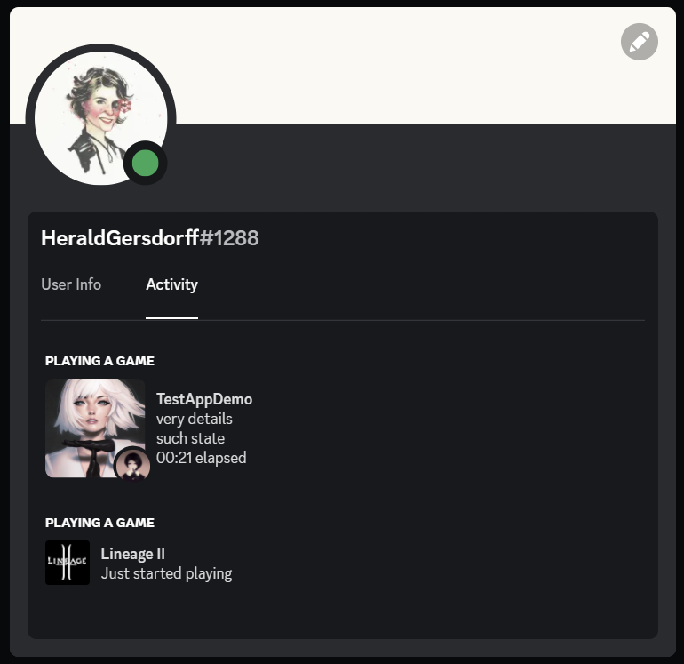

# Description

This simple library demonstrates how one may integrate Discord's rich presence to their application (e.g. for game Lineage 2).

# Setup
1. clone this repo
2. open Visual Studio 2022 (v143 toolset; Win 10.0+ SDK) solution `L2DiscordPresence.sln`
3. open `L2DiscordPresence/main.cpp`
    1. set `APP_ID` to your Discord's application ID, which you may find in [Discord Developer Portal - Application](https://discord.com/developers/applications)
    2. customize acitivity message in function `updateActivity`. You may comment out `Assets` and `Timestamps` sections if you don't want to display them
4. build project `L2DiscordPresence` with `Release` configuration for `x86` platform
5. grab built `L2DiscordPresence.dll` (from `$(OutDir)`, e.g. `bin/VS_L2DiscordPresence_Release-Win32`) with its dependency `discord_game_sdk.dll` (used `v3.2.1` from [Discord Developer Portal - Docs](https://discord.com/developers/docs/game-sdk/sdk-starter-guide#step-1-get-the-thing))
6. inject/import `L2DiscordPresence.dll` somehow to your application
    1. if you have access to source code of target application - simply link this dll & call `Anchor` somewhere
    2. in case you don't (e.g. for game Lineage 2) - it's up to you how you manage to do it

In this repo for game Lineage 2 (tested on Essence 362p) you may find modified `ogg.dll` which imports `Anchor` function from `L2DiscordPresence.dll`, thus triggering `DllMain`. So you can copy `ogg.dll`, `L2DiscordPresence.dll` and `discord_game_sdk.dll` to your client's system folder (replace `ogg.dll`) and that's it.