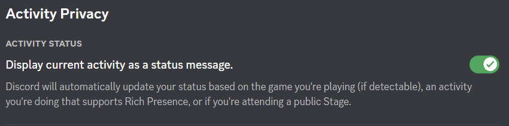

# Description

This simple library demonstrates how one may integrate Discord's rich presence to their application (e.g. for game Lineage 2).

# Requirements (running)
- [Microsoft Visual C++ Redistributable 2015-2022](https://learn.microsoft.com/en-us/cpp/windows/latest-supported-vc-redist?view=msvc-170#visual-studio-2015-2017-2019-and-2022) x64

# Discord setup
## You'll need some Discord application in order to use this library
  
1. navigate to [Discord Developer Portal - Application](https://discord.com/developers/applications):
    1. if you've already created Discord app => open it there & skip other steps in this section
    2. otherwise create new discord application:
        1. press `New Application` in the bottom right corner of the page
        2. set some `Name` for your application (`TestAppDemo` in the preview). E.g. server name/website like `soverygoodserver.org`
        3. read & agree to their terms, press `Create`
        4. you'll be redirected to your new Discord app
2. open `OAuth2 -> General`:
    1. inside `Redirects` section press `Add Redirect`
    2. fill new field with `http://127.0.0.1`
    3. press `Save Changes` in the bottom half of the page
3. open `Rich Presence -> Art Assets` (*you may skip this step in case you don't need any pics for your application*):
    1. press `Add Image(s)` & select some image(s) (**minimum image resolution is 512x512**) you wish to use for your application
    2. set some name(s) for your image(s)
    3. press `Save Changes` in the bottom half of the page
    4. **THERE'S A CATCH**: due to caching on the Discord's servers your image(s) may disappear (e.g. if you refresh this page). Don't panic and try to add them again, it's okay. Wait for a while (~5 mins) and they'll appear on their own
4. now you are ready to go

# Library setup
1. clone this repo
2. open Visual Studio 2022 (v143 toolset; Win 10.0+ SDK) solution `L2DiscordPresence.sln`
3. open `L2DiscordPresence/main.cpp`
    1. set `APP_ID` to your Discord's application ID, which you may find in [Discord Developer Portal - Application](https://discord.com/developers/applications)
    2. customize acitivity message in function `updateActivity` (*you may comment out `Assets` and `Timestamps` sections if you don't want to display them*):
        1. look at the preview in the description
        2. `TestAppDemo` = name of your Discord application
        3. `very details` = first row of text (`activity.details`)
        4. `such state` = second row of text (`activity.state`)
        5. `big pic` = name of the Art Asset from your Discord application (`assets.large_image`)
        6. `hover text for big pic` = some additional text when you hover cursor over it (`assets.large_text`)
        7. `small pic` = name of the Art Asset from your Discord application (`assets.small_image`)
        8. `hover text for small pic` = some additional text when you hover cursor over it (`assets.small_text`)
4. build project `L2DiscordPresence` with `Release` configuration for `x86` platform
5. grab built `L2DiscordPresence.dll` (from `$(OutDir)`, e.g. `bin/VS_L2DiscordPresence_Release-Win32`) with its dependency `discord_game_sdk.dll` (used `v3.2.1` from [Discord Developer Portal - Docs](https://discord.com/developers/docs/game-sdk/sdk-starter-guide#step-1-get-the-thing))
6. inject/import `L2DiscordPresence.dll` somehow to the target application
    1. if you have access to source code of the target application - simply link this dll & call `Anchor` somewhere
    2. in case you don't (e.g. for game Lineage 2) - it's up to you how you manage to do it
7. launch Discord app, then launch the target application & you should see customized activity message "Playing a game"
    1. you have to be online in Discord
    2. `Display currenct activity as a status message` in `Settings -> Activity Privacy -> Activity Status` should be enabled

    

In this repo for game Lineage 2 (tested on Essence 362p) you may find modified `ogg.dll` which imports `Anchor` function from `L2DiscordPresence.dll`, thus triggering `DllMain`. So you can copy `ogg.dll`, `L2DiscordPresence.dll` and `discord_game_sdk.dll` to your client's system folder (replace `ogg.dll`) and that's it.